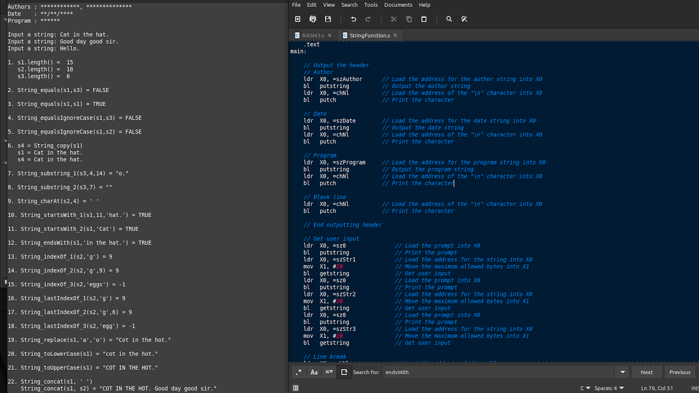

# ARM64 Assembly String Operations

An ARM64 assembly program that implements several core string operations from scratch using low-level memory and register manipulation.



## ⚠️ Project Status

**This is an archived academic project and is intended to showcase programming concepts rather than a production-ready tool.**
Some components were developed collaboratively and may not handle all edge cases correctly.
For functional projects, please see [other repositories in my portfolio.](https://rainbonium.github.io/)

## Overview

This project demonstrates low-level Assembly implementations of the following common string operations:

* str_length
* str_equals
* str_equalsIgnoreCase
* str_copy
* str_substring
* str_charAt
* str_startsWith
* str_endsWith
* str_indexOf
* str_lastIndexOf
* str_replace
* str_toLower
* str_toUpper
* str_concat

The program accepts three strings from the user and then manipulates them using each of the above functions, printing the outputs.

## Tech

This project demonstrates:
* Linux
* ARM64 Assembly

## How It Works

* The user inputs three strings.
* Strings are stored in fixed-size memory buffers.
* Each string operation is implemented as a separate assembly function that operates directly on memory addresses.
* Results are printed to the console through helper functions.
* Dynamically allocated memory is freed afterwards.

## How to Run

**This project requires an ARM64 environment or emulator to run. Terminal commands to operate may vary between environments.**

### Compile (Optional):
```bash
aarch64-linux-gnu-gcc -o StringFunction StringFunction.o ../obj/*.o
```

### Run:
```bash
qemu-aarch64 -L /usr/aarch64-linux-gnu ./StringFunction
```

## Highlights

### Example Branch
The main file runs external assembly functions using the branch and link command. X0 (Register 0) is used as the input and output for the function.

```as
ldr  X0, =sz1a              // Load the address of the disp string into X0
bl   putstring              // Print the string
ldr  X0, =szStr1            // Load the address of the string into X0
bl   str_length1            // Find the length of the string
ldr  X1, =szTmp             // Load an address into X1 to store the converted int
bl   int64asc               // Branch and link to int64asc
ldr  X0, =szTmp             // Load the address of temporary string into X0
bl   putstring              // Branch and link to putstring
ldr  X0, =chNl              // Load the address of the null
bl   putch                  // Print the char
```

## What I Learned
* How to translate high-level string operations into low-level memory and pointer manipulation.
* Managing heap allocation and avoiding memory leaks.
* Advantages and trade-offs of low-level memory management.
* Handling debugging challenges unique to assembly.

## What I Could Improve

If I were to remake this project today, I would:
* Add input validation to prevent memory issues.
* Fix known issues with unexpected user input.
* Add a menu interface for improved usability.